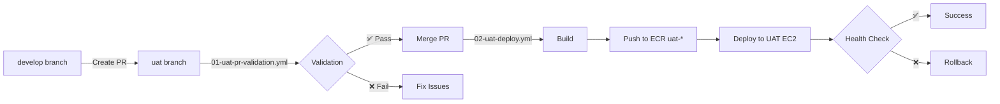

# UAT Environment Setup Guide

## Overview

This document describes the UAT (User Acceptance Testing) environment configuration and deployment process.

## Architecture

### Single VM Deployment

Both DEV and UAT environments run on the **same EC2 instance** (`34.193.107.130`) but use different ports:

### DEV Environment

- **Branch:** `develop`
- **ECR Image:** `p9-spectra2.0-dev-ui`
- **Container:** `p9-spectra2.0-dev-ui`
- **Tags:** `dev-<timestamp>-<short-sha>`
- **Port:** 80 (host) → 3000 (container)
- **URL:** http://34.193.107.130

### UAT Environment

- **Branch:** `uat`
- **ECR Image:** `p9-spectra2.0-uat-ui`
- **Container:** `p9-spectra2.0-uat-ui`
- **Tags:** `uat-<timestamp>-<short-sha>`
- **Port:** 8080 (host) → 3000 (container)
- **URL:** http://34.193.107.130:8080

### Shared Resources

- Same AWS credentials and ECR registry
- Same EC2 host and SSH credentials
- Same GitHub Secrets (no separate UAT secrets needed)

### Isolated Resources

- Separate Docker containers
- Separate ECR image tags
- Separate network ports

## Workflows

### 1. PR Validation: `01-uat-pr-validation.yml`

**Triggers:** PR targeting `uat` branch

**Validation Rules:**

- ✅ **Source branch MUST be `develop`** (enforced)
- ✅ Security scan
- ✅ Linting
- ✅ Build with UAT environment variables

**Features:**

- Automatic source branch validation
- Comments on PR with validation status
- Fails if source is not `develop`

### 2. Deployment: `02-uat-deploy.yml`

**Triggers:**

- Push to `uat` branch
- Merged PR to `uat` branch

**Process:**

1. Security scan
2. Lint check
3. Build with UAT env vars
4. Docker build with separate UAT tags
5. Push to ECR
6. Deploy to UAT EC2 server
7. Health check with rollback support

## Required GitHub Secrets

Most secrets are **shared between DEV and UAT**, except for ECR registry:

### AWS & ECR

- `AWS_ACCESS_KEY_ID` - Shared AWS credentials
- `AWS_SECRET_ACCESS_KEY` - Shared AWS credentials
- `AWS_REGION` - Shared AWS region
- `AWS_ECR_REGISTRY` - **DEV ECR repository** (e.g., `891146181139.dkr.ecr.us-east-1.amazonaws.com/p9-spectra2.0-dev-ui`)
- `AWS_ECR_REGISTRY_UAT` - **UAT ECR repository** (e.g., `891146181139.dkr.ecr.us-east-1.amazonaws.com/p9-spectra2.0-uat-ui`)

**Note**: If `AWS_ECR_REGISTRY_UAT` is not configured, it will fall back to using `AWS_ECR_REGISTRY` (not recommended for production).

### EC2 Server (Same VM for both environments)

- `EC2_HOST` - EC2 server IP (34.193.107.130)
- `EC2_USERNAME` - Server username (ubuntu)
- `EC2_SSH_KEY` - SSH private key content

### Environment Variables (Vite build-time variables)

- `VITE_GRAPHQL_ENDPOINT`
- `VITE_SSE_ENDPOINT_URL`
- `VITE_CHAT_API_URL`
- `VITE_IMAGE_CHAT_API_URL`

**Note:** Same secrets are used for both DEV and UAT deployments. The only difference is the port mapping:

- DEV uses port 80
- UAT uses port 8080

## Setup Instructions

### 1. Create UAT Branch

```bash
# From develop branch
git checkout develop
git pull origin develop

# Create UAT branch
git checkout -b uat
git push origin uat
```

### 2. Verify GitHub Secrets

The same secrets used for DEV are automatically reused for UAT. Verify they exist:

Go to: `Settings` → `Secrets and variables` → `Actions`

Required secrets:

```
AWS_ACCESS_KEY_ID
AWS_SECRET_ACCESS_KEY
AWS_REGION
AWS_ECR_REGISTRY
EC2_HOST (should be 34.193.107.130)
EC2_USERNAME (should be ubuntu)
EC2_SSH_KEY
VITE_GRAPHQL_ENDPOINT
VITE_SSE_ENDPOINT_URL
VITE_CHAT_API_URL
VITE_IMAGE_CHAT_API_URL
```

### 3. EC2 Server is Already Configured

The UAT environment uses the **same EC2 server as DEV** (34.193.107.130).

No additional server setup required! Docker and AWS CLI are already installed from DEV setup.

UAT will run alongside DEV on different ports:

- DEV: Port 80
- UAT: Port 8080

## Deployment Workflow

### Standard Flow: develop → uat



### Step-by-Step

1. **Create PR from develop to uat**

   ```bash
   # On develop branch
   git checkout develop
   git pull origin develop

   # Create PR via GitHub UI or CLI
   gh pr create --base uat --head develop --title "Release to UAT"
   ```

2. **PR Validation Runs**
   - Validates source is `develop`
   - Runs security scan
   - Runs linting
   - Builds with UAT env vars
   - Comments status on PR

3. **Review & Merge**
   - Review PR
   - Merge to `uat` branch

4. **Automatic Deployment**
   - Builds production bundle
   - Creates Docker image with `uat-*` tags
   - Deploys to UAT EC2
   - Performs health checks
   - Auto-rollback on failure

## Validation Rules

### PR Validation Strictness

- ✅ **MUST** be from `develop` branch
- ✅ **MUST** target `uat` branch
- ✅ **MUST** pass security scan (warnings allowed)
- ✅ **MUST** pass lint checks
- ✅ **MUST** build successfully

Any other source branch will be **automatically rejected**.

## Rollback

If UAT deployment fails:

1. Health check fails after 6 retries
2. Previous container image is automatically restored
3. Deployment marked as failed
4. Manual investigation required

## Monitoring

### GitHub Actions

- View workflow runs: `Actions` tab
- Filter by workflow: `02: UAT → UAT Environment (Deploy)`
- Check logs for deployment status

### Server Monitoring (Both DEV and UAT on same VM)

```bash
# SSH to server
ssh -i Spectra-2.0-Frontend-UI.pem ubuntu@34.193.107.130

# Check both containers
docker ps

# Expected output:
# p9-spectra2.0-dev-ui  0.0.0.0:80->3000/tcp
# p9-spectra2.0-uat-ui  0.0.0.0:8080->3000/tcp

# View UAT logs
docker logs p9-spectra2.0-uat-ui

# View DEV logs
docker logs p9-spectra2.0-dev-ui

# Check UAT health
curl http://localhost:8080/

# Check DEV health
curl http://localhost:80/
```

## Troubleshooting

### Issue: PR validation fails with "Invalid Source Branch"

**Solution:** Only create PRs from `develop` to `uat`. Close incorrect PRs.

### Issue: Build fails with missing env vars

**Solution:** Verify GitHub Secrets are configured. Same secrets used for both DEV and UAT.

### Issue: Deployment fails to connect to EC2

**Solution:** Verify `EC2_HOST` and `EC2_SSH_KEY` secrets. UAT uses same EC2 as DEV.

### Issue: Container fails health check on port 8080

**Solution:**

1. SSH to server: `ssh ubuntu@34.193.107.130`
2. Check logs: `docker logs p9-spectra2.0-uat-ui`
3. Verify port 8080 is available: `sudo lsof -i :8080`
4. Test manually: `curl http://localhost:8080/`

### Issue: Port conflict between DEV and UAT

**Solution:** DEV uses port 80, UAT uses port 8080. They should not conflict.

## Comparison: DEV vs UAT

| Aspect         | DEV                     | UAT                        |
| -------------- | ----------------------- | -------------------------- |
| Branch         | `develop`               | `uat`                      |
| PR Source      | Any branch              | **Only `develop`**         |
| EC2 Host       | 34.193.107.130          | **Same (34.193.107.130)**  |
| Port           | 80 → 3000               | **8080 → 3000**            |
| URL            | http://34.193.107.130   | http://34.193.107.130:8080 |
| ECR Image      | `p9-spectra2.0-dev-ui`  | `p9-spectra2.0-uat-ui`     |
| Image Tags     | `dev-<timestamp>-<sha>` | `uat-<timestamp>-<sha>`    |
| Container Name | `p9-spectra2.0-dev-ui`  | `p9-spectra2.0-uat-ui`     |
| Secrets        | Same as DEV             | **Same as DEV**            |
| Validation     | Basic checks            | Source = `develop` only    |

## Best Practices

1. **Always PR from develop to uat** - Never push directly
2. **Test in DEV first** - Only promote tested features to UAT
3. **Use meaningful commit messages** - Helps tracking in UAT
4. **Monitor deployments** - Check GitHub Actions & server logs
5. **Communicate releases** - Notify QA team when UAT is updated

## Questions?

Contact the DevOps team or check:

- GitHub Actions documentation
- AWS ECR documentation
- Docker documentation
